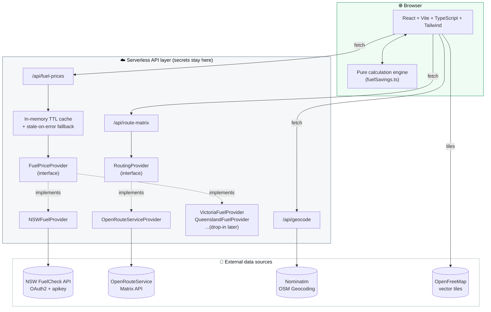

<div align="center">


<a href="#">
  
</a>

<br/>

[](https://api.nsw.gov.au/Product/Index/22)
[](https://react.dev)
[](https://www.typescriptlang.org)
[](https://vitejs.dev)
[](LICENSE)

</div>

<br/>

> **The whole point, in one sentence:** *"I'm here right now — find me the cheapest nearby fuel, and tell me honestly whether driving to it is actually worth the extra fuel I'll burn getting there."*

This is **not** a navigation app. It's **not** a trip planner. It answers exactly one question, honestly, with real numbers — and it never just points you at the cheapest litre in town without checking whether getting there actually pays off.

<br/>

## ✨ What it does

<table>
<tr>
<td width="50%" valign="top">

### 🧭 The flow
1. 📍 Auto-detects your location (asks once — never nags)
2. ⛽ Pulls **every** fuel type the data source actually reports — nothing hardcoded
3. 🗺️ Shows nearby stations on a live map **and** a sortable list
4. 🛣️ Calculates **real road-driving distance** (not straight-line) to each one
5. 💰 Works out the *actual* net saving after accounting for the extra fuel burned getting there
6. 🟢🟡🔴 Tells you plainly: worth it, break-even, or skip it

</td>
<td width="50%" valign="top">

### 🎯 Design principles
- Never invents prices, stations, or distances
- Never hides a station just because it isn't worth the drive
- Never silently swaps road distance for straight-line without saying so
- No account, no login, no unnecessary location storage
- Every state-specific data source is swappable behind one interface

</td>
</tr>
</table>

<br/>

## 🧮 The calculation that actually matters

Most "cheap fuel" apps stop at *cheapest price*. That's the wrong answer if the cheap station is 15 minutes further away.

```text
Baseline station   →  $2.05/L,  2 km driving distance
Alternative station →  $1.95/L,  8 km driving distance
Buying 50 L, vehicle uses 8 L/100km

  Price saving        =  ($2.05 − $1.95) × 50            =  $5.00
  Extra distance      =  8 km − 2 km                      =  6 km
  Extra fuel burned   =  6 km × 8 L/100km                 =  0.48 L
  Extra fuel cost     =  0.48 L × $1.95                    ≈  $0.94
  ─────────────────────────────────────────────────────────────────
  Actual net saving   =  $5.00 − $0.94                     ≈  $4.06  ✅
```

That worked example is a literal test case in [`src/lib/calculations/fuelSavings.test.ts`](src/lib/calculations/fuelSavings.test.ts) — 22 tests cover it plus break-even pricing, closer-alternative bonuses, thirsty vehicles, zero/invalid input, and missing route data. The whole engine is pure, framework-free TypeScript with zero UI dependencies.

<details>
<summary><b>🟡 What "break-even price" means</b></summary>
<br/>

Every comparison also calculates the exact price the alternative station would need to hit for the trip to net **exactly $0** — derived by solving the net-saving equation for price, not guessed:

```
breakEvenPrice = (baselinePrice × litres) / (litres + extraFuelLitres)
```

Shown in the "How did we calculate this?" panel on every station card, so the verdict never feels like a black box.

</details>

<br/>

## 🏗️ Architecture

<div align="center">



</div>

**Why a backend layer at all?** The NSW FuelCheck API requires an OAuth2 consumer key/secret that must *never* reach the browser. Every external call — FuelCheck, OpenRouteService, Nominatim — is proxied through `/api/*` serverless functions, normalised into our own [`Station` / `FuelPrice`](shared/types.ts) model, and cached so the free tiers of every provider go a long way.

**Adding a new state (e.g. Victoria) later** means writing one class that implements `FuelPriceProvider` and registering it in [`api/_lib/providers/index.ts`](api/_lib/providers/index.ts) — nothing in the frontend, the routing layer, or the calculation engine changes.

<br/>

## 📡 Data sources — what we researched and chose

<table>
<tr><th>Need</th><th>Chosen source</th><th>Why</th></tr>
<tr>
<td>Live NSW fuel prices</td>
<td><a href="https://api.nsw.gov.au/Product/Index/22">NSW FuelCheck API</a></td>
<td>The <em>official</em> government-mandated source — retailers are legally required to report price changes. OAuth2 client-credentials + <code>apikey</code> header, 2,500 free calls/month. We cache the full price snapshot for 15 min, so real usage stays well under quota.</td>
</tr>
<tr>
<td>Road-driving distance/time</td>
<td><a href="https://openrouteservice.org">OpenRouteService</a> Matrix API</td>
<td>Free tier (2,000 directions/day, 2,500 matrix/day), no credit card, one batched request covers up to 25 candidate stations per search instead of one call per station.</td>
</tr>
<tr>
<td>Address/suburb/postcode search</td>
<td><a href="https://nominatim.org">Nominatim</a> (OpenStreetMap)</td>
<td>Free, no API key. Proxied server-side with a proper User-Agent and per-query caching to respect its 1 req/sec usage policy.</td>
</tr>
<tr>
<td>Map tiles</td>
<td><a href="https://openfreemap.org">OpenFreeMap</a> + <a href="https://maplibre.org">MapLibre GL</a></td>
<td>Free vector tiles, no API key, no request quota — chosen over Google Maps specifically to avoid a paid, key-gated dependency for something this app treats as a convenience layer, not its core purpose.</td>
</tr>
</table>

Full findings — auth flow, exact endpoints, response shapes, rate limits — are documented inline in [`api/_lib/providers/nswFuelClient.ts`](api/_lib/providers/nswFuelClient.ts) and [`api/_lib/routing/OpenRouteServiceProvider.ts`](api/_lib/routing/OpenRouteServiceProvider.ts).

<br/>

## 🚀 Getting started

```bash
git clone https://github.com/iNotrez/cheapest-fuel-finder.git
cd cheapest-fuel-finder
npm install
cp .env.example .env   # then fill in your API keys — see below
npm run dev
```

<details>
<summary><b>🔑 Getting API keys (all free)</b></summary>
<br/>

| Variable | Where to get it |
|---|---|
| `NSW_FUELCHECK_API_KEY` / `NSW_FUELCHECK_API_SECRET` | Register at [api.nsw.gov.au](https://api.nsw.gov.au), subscribe to the **Fuel API** product, create an application |
| `ORS_API_KEY` | Free account at [account.heigit.org](https://account.heigit.org) |
| `NOMINATIM_USER_AGENT` | Any descriptive string with a contact email — required by OSM's usage policy |

Never commit a real `.env` file — it's already gitignored.

</details>

```bash
npm test          # run the calculation engine's test suite (Vitest)
npm run build      # typecheck + production build
npm run typecheck  # TypeScript only
```

The frontend expects `/api/*` to be served alongside it — locally that's `vercel dev`, or point Vite's proxy (see `vite.config.ts`) at any server implementing the same three routes.

<br/>

## 📁 Project structure

```text
shared/                  Types + geo utils shared by frontend and backend
├─ types.ts               Normalised Station / FuelPrice / RouteDistance models
└─ geo.ts                 Haversine distance (fallback-only, never primary)

api/                      Vercel serverless functions — secrets live here only
├─ fuel-prices.ts          GET  lat/lng/radius/fuelType → normalised stations
├─ route-matrix.ts         POST origin + destinations   → road distances/times
├─ geocode.ts               GET  address/suburb/postcode → coordinates
└─ _lib/
   ├─ providers/            FuelPriceProvider interface + NSWFuelProvider
   ├─ routing/               RoutingProvider interface + OpenRouteServiceProvider
   ├─ cache.ts               TTL cache with stale-on-error fallback
   └─ time.ts                Sydney-local timestamp parsing → correct UTC

src/
├─ lib/calculations/       fuelSavings.ts — the pure, fully-tested calculation engine
├─ lib/compareStations.ts  Wires providers + calculation engine into UI-ready data
├─ hooks/                  useGeolocation, useFuelStations, useRouteDistances
├─ components/             StationCard, MapView, FuelTypeGrid, VehicleSettingsPanel…
└─ store/                  Persisted vehicle settings (localStorage, no account)
```

<br/>

## 🗺️ Roadmap

- [x] NSW via FuelCheck (`NSWFuelProvider`)
- [ ] Victoria, Queensland, SA, WA, TAS, NT, ACT — same `FuelPriceProvider` interface, new provider classes
- [ ] Configurable search radius in the UI (backend already accepts any radius up to 50km)
- [ ] Persisted external cache (Vercel KV/Blob) instead of per-instance memory, for higher-traffic deployments

<br/>

## 📄 License

MIT — see [LICENSE](LICENSE).

<div align="center">
<br/>


</div>
